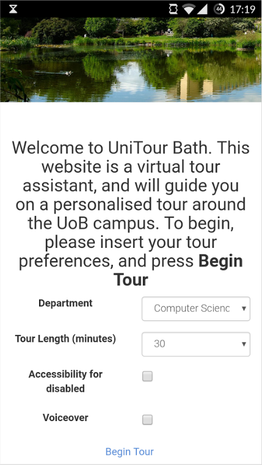
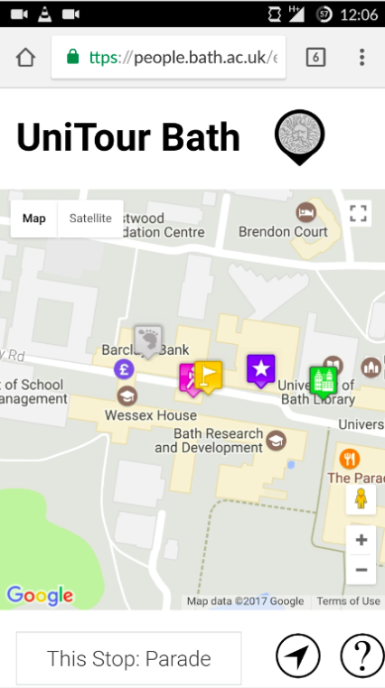

# UniTour Bath

UniTour Bath is a mobile optimised web app that acts as a virtual tour guide of the University of Bath campus. It was built as part of our Integrated Group Project in our 2nd year of studying Computer Science.

## How it works

Users can personalise their tour based on the university department they wish to visit, their ideal tour length in minutes and whether they require disability access. Upon pressing **Begin Tour**, the user is presented with a map marked with with various points of interest (POI) which they will be shown on their personalised tour.

As the user walks around, their location is updated on the map using their phone's GPS. Once they walk close enough to the next POI on the tour they are prompted to view information on their screen that would be given to them on a standard open-day campus tour. The next POI of the tour is then highlighted on the map and the user can continue on their tour when they are ready.

  
  

## Tech

This web application was built using plain HTML, JavaScript, CSS and PHP, which was hosted on the University of Bath's webspace for the duration of the project. The system would interact with a MySQL database containing all details regarding POIs across campus. Map functionality is based on the Google Maps API. All tour information is downloaded at the beginning of the tour which means that users need not worry about maintaining an internet connection throughout the tour - only a GPS connection is required.